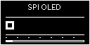

# STM32F103 SPI OLED GIF 动画

基于 STM32F103C8T6、标准外设库和 Keil5 的 SSD1306 128x64 SPI OLED 动画工程。

电脑端把 GIF 转换成单色帧数组，STM32 使用 SPI2 从 Flash 读取并非阻塞循环播放。
工程保留原有 I2C OLED 驱动，不引入 RTOS、动态内存或 STM32 端 GIF 解析。



## 主要功能

- SPI2 驱动 SSD1306 128x64 单色 OLED。
- 显示文字、全屏图片和多帧动画。
- 使用 `Timing_GetTick()` 非阻塞切换动画帧。
- GIF 自动缩放、二值化并转换为 SSD1306 页格式。
- 双击选择 GIF，自动转换、Keil 编译并通过 ST-Link 烧录。
- 保留原有 PB6/PB7 软件 I2C OLED 和光敏传感器界面。

## 硬件

- STM32F103C8T6 最小系统板
- SSD1306 128x64 四线 SPI OLED
- ST-Link 下载器
- 3.3V 电源和连接线

## 接线

| OLED | STM32F103 | 说明 |
| --- | --- | --- |
| SCK / D0 / SCL | PB13 | SPI2 时钟 |
| MOSI / D1 / SDA | PB15 | SPI2 数据 |
| CS | PB12 | 片选，低电平有效 |
| DC | PB14 | 命令/数据选择 |
| RST / RES | PB10 | OLED 复位 |
| VCC | 3.3V | 电源 |
| GND | GND | 共地 |

OLED 不需要连接 MISO。

## 一键使用

1. 安装 Python 3 和 Keil5。
2. 使用 ST-Link 连接并给开发板供电。
3. 确认 OLED 按上表接线。
4. 双击 [一键更换GIF并烧录.bat](一键更换GIF并烧录.bat)。
5. 在弹窗中选择 GIF。
6. 等待转换、编译和烧录完成。

工具固定使用以下参数：

```text
最大帧数：20
画面尺寸：128x64
二值化阈值：128
播放间隔：100 ms
```

首次运行缺少 Pillow 时，工具会询问是否自动安装。

## 首次配置

烧录功能使用 Keil 工程中配置的下载器。首次使用需要打开
`Project/led.uvprojx`，在以下页面选择实际连接的 ST-Link：

```text
Options for Target
├─ Debug
└─ Utilities
```

通常只需配置一次。之后双击脚本即可更换 GIF、编译和烧录。

如果暂时没有连接 ST-Link，GIF 转换和编译结果仍会保留：

```text
User/anim_frames.c
User/anim_frames.h
Output/led.hex
```

连接下载器后可以再次运行脚本，或在 Keil 中点击 Download。

## 手工转换

需要自定义参数时，可使用原始命令行工具：

```powershell
py -m pip install pillow
py Tools/gif_to_oled_frames.py input.gif User/anim_frames.c --max-frames 20 --threshold 128 --interval 100
```

可加 `--invert` 反转黑白颜色。

转换后 `anim_frames.c/.h` 已经在 Keil 工程中，不需要重新添加文件，只需 Rebuild
并 Download。

## 工程结构

```text
User/
  bsp_spi_oled.c/.h       SPI2 和 SSD1306 驱动
  app_anim.c/.h           非阻塞动画任务
  anim_frames.c/.h        GIF 转换后的帧数组
Tools/
  simple_gif_flash.py     一键弹窗工具
  gif_to_oled_frames.py   GIF 转换核心脚本
Assets/
  oled_demo.gif           12 帧示例动画
Project/
  led.uvprojx             Keil5 工程
docs/
  spi_oled_gif_animation.md
```

## 容量

每帧固定占用：

```text
128 × 64 ÷ 8 = 1024 字节
```

20 帧约占 20 KB Flash。STM32F103C8T6 标称通常为 64 KB Flash、20 KB RAM。
动画数组带 `const`，直接保存在 Flash，不会占用等量 RAM。

## 显示模式

`User/main.c` 中：

```c
#define SPI_OLED_ANIM_DEMO 1U
```

- `1U`：SPI OLED 动画模式。
- `0U`：恢复原有光敏传感器和 I2C OLED 界面。

## 常见问题

### 屏幕不亮

依次检查 3.3V、共地、RST、CS、DC、SCK、MOSI，并确认模块实际为四线 SPI。

### 图像左右错位

模块可能是 SH1106，需要在列地址中增加约 2 列偏移。当前工程默认按 SSD1306 实现。

### 烧录失败

检查开发板供电、ST-Link 的 SWDIO/SWCLK/GND 接线，以及 Keil Debug 和 Utilities
页面中的下载器设置。

### Flash 超限

减少 GIF 帧数。推荐 8 至 20 帧、5 至 12 FPS。

## 详细文档

完整接口说明、SSD1306/SH1106 差异和排错顺序见：

[docs/spi_oled_gif_animation.md](docs/spi_oled_gif_animation.md)

